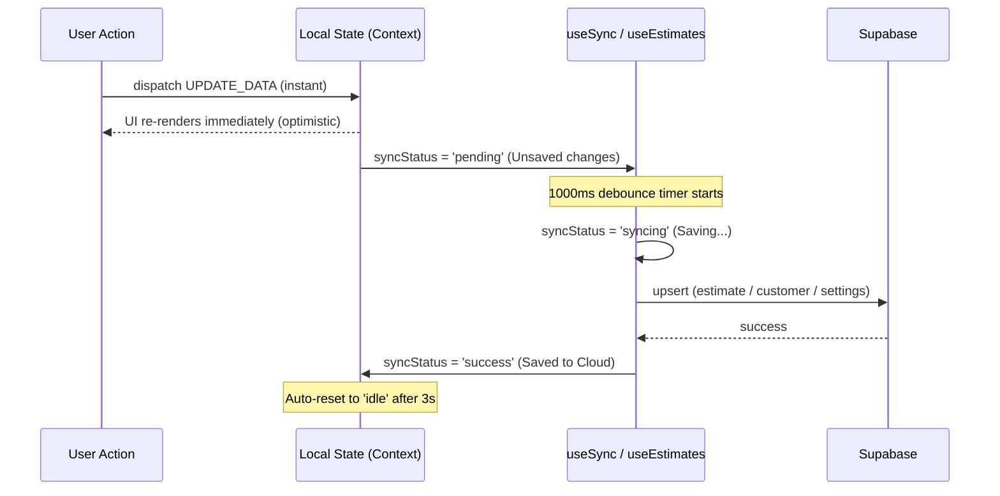

## Objective
Fix existing logic/workflow bugs, implement a local-first optimistic update pattern with 1000ms debounced Supabase `upsert`, and surface a 4-state sync indicator across the full UI.

---

## Bugs to Fix First

### Bug 1 — `Calculator.tsx`: JSX syntax error (broken prop)
- **File**: `components/Calculator.tsx`
- **Issue**: `onRemoveInventory={id}` passes a variable `id` (undefined in scope) instead of the handler function.
- **Fix**: Change to `onRemoveInventory={onRemoveInventory}`

### Bug 2 — `useEstimates.ts`: Warehouse restore delta lost on delete
- **File**: `hooks/useEstimates.ts` → `handleDeleteEstimate`
- **Issue**: The computed `updatePayload` (which includes the restored warehouse quantities) is ignored. The dispatch calls `appData.savedEstimates.filter(...)` directly, losing the warehouse restore.
- **Fix**: Change dispatch to use `updatePayload` which already contains both `savedEstimates` and the corrected `warehouse`.

### Bug 3 — `useEstimates.ts`: `saveEstimate` never writes to Supabase
- **File**: `hooks/useEstimates.ts` → `saveEstimate`
- **Issue**: The function updates local state via `dispatch` but never calls `createEstimate` or `updateEstimate`. Estimates only exist in memory / localStorage and are lost on a fresh session if not manually refreshed.
- **Fix**: Add background Supabase upsert call after the local dispatch (see Phase 3).

---

## Sync Status State Machine

The internal `syncStatus` values in `CalculatorContext.tsx` remain unchanged (`idle | pending | syncing | success | error`). A display map translates these to user-facing labels:

| Internal value | Display label      | Color  | Icon          |
|----------------|--------------------|--------|---------------|
| `pending`      | Unsaved changes    | Amber  | Clock         |
| `syncing`      | Saving...          | Blue   | Spinner       |
| `success`      | Saved to Cloud     | Green  | CheckCircle   |
| `error`        | Error              | Red    | AlertCircle   |
| `idle`         | (quiet, no label)  | Gray   | —             |

---

## Data Flow After Changes



---

## Implementation Steps

### Step 1 — Fix the three bugs above
- `components/Calculator.tsx`: `onRemoveInventory={id}` → `onRemoveInventory={onRemoveInventory}`
- `hooks/useEstimates.ts` `handleDeleteEstimate`: Replace both dispatch calls with `dispatch({ type: 'UPDATE_DATA', payload: updatePayload })`

---

### Step 2 — Add upsert functions to `services/api.ts`

**New / changed functions:**

```ts
// Replace separate select+update/insert with a single upsert
export const upsertCompanySettings = async (settings: any): Promise<boolean> => {
  const { error } = await supabase
    .from('company_settings')
    .upsert({ /* mapped fields */ }, { onConflict: 'company_id' });
  return !error;
};

export const upsertEstimate = async (estimate: Partial<EstimateRecord>): Promise<boolean> => {
  const { error } = await supabase
    .from('estimates')
    .upsert({ ...estimate, updated_at: new Date().toISOString() }, { onConflict: 'id' });
  return !error;
};

export const upsertCustomer = async (customer: CustomerProfile): Promise<boolean> => {
  const { error } = await supabase
    .from('customers')
    .upsert({ ...customer, updated_at: new Date().toISOString() }, { onConflict: 'id' });
  return !error;
};
```

- Keep existing `createEstimate`, `updateEstimate`, `createCustomer`, `updateCustomer` for backwards compatibility where still needed.
- Replace `updateCompanySettings` calls with `upsertCompanySettings`.

---

### Step 3 — Refactor `hooks/useSync.ts`

**Changes:**
- Reduce debounce from `3000ms` → `1000ms`
- Immediately set `syncStatus = 'pending'` when `appData` changes (before the timer fires)
- When timer fires, set `syncStatus = 'syncing'`
- On success, set `'success'` then schedule reset to `'idle'` after 3s
- On failure, set `'error'`
- Replace `updateCompanySettings` call with `upsertCompanySettings`
- `saveEstimateToSupabase` and `saveCustomerToSupabase` now call `upsertEstimate` / `upsertCustomer`

```ts
// Auto-save effect (simplified structure)
useEffect(() => {
  if (ui.isLoading || !ui.isInitialized || !session || session.role === 'crew') return;

  localStorage.setItem(`foamProState_${session.username}`, JSON.stringify(appData));
  dispatch({ type: 'SET_SYNC_STATUS', payload: 'pending' }); // Unsaved changes — instant

  if (syncTimerRef.current) clearTimeout(syncTimerRef.current);

  syncTimerRef.current = setTimeout(async () => {
    dispatch({ type: 'SET_SYNC_STATUS', payload: 'syncing' }); // Saving...
    try {
      await upsertCompanySettings({ costs: appData.costs, yields: appData.yields, ... });
      dispatch({ type: 'SET_SYNC_STATUS', payload: 'success' }); // Saved to Cloud
      setTimeout(() => dispatch({ type: 'SET_SYNC_STATUS', payload: 'idle' }), 3000);
    } catch {
      dispatch({ type: 'SET_SYNC_STATUS', payload: 'error' }); // Error
    }
  }, 1000); // 1000ms debounce

  return () => { if (syncTimerRef.current) clearTimeout(syncTimerRef.current); };
}, [appData, ui.isLoading, ui.isInitialized, session, dispatch]);
```

---

### Step 4 — Refactor `hooks/useEstimates.ts`

**`saveEstimate` — add background Supabase upsert:**
```ts
// After local dispatch (optimistic update already done):
dispatch({ type: 'SET_SYNC_STATUS', payload: 'pending' });

// Background save — non-blocking
(async () => {
  dispatch({ type: 'SET_SYNC_STATUS', payload: 'syncing' });
  const ok = await upsertEstimate(newEstimate);
  if (ok) {
    dispatch({ type: 'SET_SYNC_STATUS', payload: 'success' });
    setTimeout(() => dispatch({ type: 'SET_SYNC_STATUS', payload: 'idle' }), 3000);
  } else {
    dispatch({ type: 'SET_SYNC_STATUS', payload: 'error' });
  }
})();
```

**`saveCustomer` — optimistic update + background upsert:**
```ts
const saveCustomer = async (customerData: CustomerProfile) => {
  // 1. Optimistic local update first
  const updatedCustomers = /* ... existing logic ... */;
  dispatch({ type: 'UPDATE_DATA', payload: { customers: updatedCustomers, ... } });
  dispatch({ type: 'SET_SYNC_STATUS', payload: 'pending' });

  // 2. Background Supabase sync
  (async () => {
    dispatch({ type: 'SET_SYNC_STATUS', payload: 'syncing' });
    const ok = await upsertCustomer(customerData);
    dispatch({ type: 'SET_SYNC_STATUS', payload: ok ? 'success' : 'error' });
    if (ok) setTimeout(() => dispatch({ type: 'SET_SYNC_STATUS', payload: 'idle' }), 3000);
  })();
};
```

---

### Step 5 — Update `components/Layout.tsx` sync status display

Replace the existing minimal `syncStatus` text with a full 4-state display in:
- **Desktop sidebar** (bottom-left status area)
- **Mobile header** (right icon area)

```tsx
// Sync status label map
const SYNC_LABELS = {
  pending:  { label: 'Unsaved changes', color: 'text-amber-500',  icon: Clock        },
  syncing:  { label: 'Saving...',       color: 'text-blue-500',   icon: RefreshCw    },
  success:  { label: 'Saved to Cloud',  color: 'text-emerald-500',icon: CheckCircle2 },
  error:    { label: 'Error',           color: 'text-red-500',    icon: AlertCircle  },
  idle:     { label: '',                color: 'text-slate-400',  icon: null         },
};

// Desktop sidebar (replaces existing single-line text):
const syncInfo = SYNC_LABELS[syncStatus];
{syncInfo.icon && (
  <span className={`flex items-center gap-1 text-[10px] font-bold ${syncInfo.color}`}>
    <syncInfo.icon className={`w-3 h-3 ${syncStatus === 'syncing' ? 'animate-spin' : ''}`} />
    {syncInfo.label}
  </span>
)}

// Mobile header (replaces existing icon-only display):
// Show icon + short label inline when status is not idle
```

---

### Step 6 — Create `components/SyncStatusBadge.tsx` (new reusable component)

A small portable badge used in `Layout`, `Settings`, and `Profile` pages:

```tsx
// UI snippet for the badge (sits in Layout sidebar and mobile header):
<SyncStatusBadge status={syncStatus} />

// Renders as:
// [amber  ●] Unsaved changes
// [blue  ↻] Saving...          (spinner animates)
// [green ✓] Saved to Cloud
// [red   !] Error
// (nothing when idle)
```

Props: `status: 'idle' | 'pending' | 'syncing' | 'success' | 'error'`

---

## Files Changed — Summary

| File | Type of Change |
|------|----------------|
| `components/Calculator.tsx` | Bug fix — prop typo |
| `hooks/useEstimates.ts` | Bug fix (delete) + optimistic upsert for saves + customer upsert |
| `hooks/useSync.ts` | 1000ms debounce + pending state + `upsertCompanySettings` |
| `services/api.ts` | Add `upsertEstimate`, `upsertCustomer`, `upsertCompanySettings` |
| `components/Layout.tsx` | Full 4-state sync status display (desktop + mobile) |
| `components/SyncStatusBadge.tsx` | New reusable sync status badge component |

---

## Verification Checklist (Definition of Done)

- [ ] `Calculator.tsx` compiles without type error on `onRemoveInventory`
- [ ] Deleting an estimate with inventory correctly restores warehouse quantities
- [ ] Saving an estimate updates local state immediately (no delay) and triggers background Supabase upsert
- [ ] Supabase uses `upsert` for estimates, customers, and company_settings (no separate select-then-insert)
- [ ] Sync status cycles: `pending` → `syncing` → `success` (or `error`) on every save
- [ ] Debounce is confirmed at 1000ms (company_settings auto-save)
- [ ] Desktop sidebar shows the correct label for all 4 non-idle states
- [ ] Mobile header shows icon + label for all non-idle states
- [ ] `SyncStatusBadge` is reused in Settings and Profile pages where `syncStatus` is already passed as a prop
